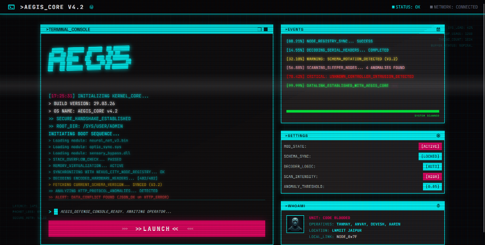
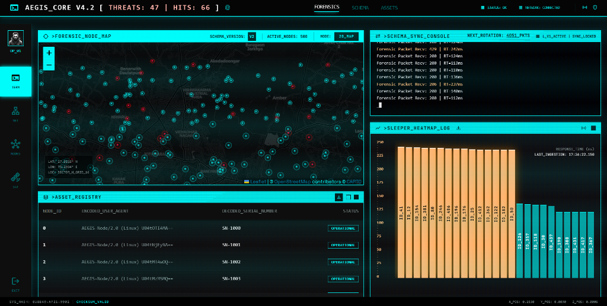

# AEGIS Cyber Infrastructure Defense 🛡️🛰️

> **Project AEGIS** — Identify the "Shadow Controller" infiltrating Nexus City's infrastructure
> by cutting through deceptive telemetry data to expose real attack patterns.
>
> Built by **Code Blooded** — Tanmay, Anvay, Devesh, Aarin @ LNMIIT Jaipur

---

## 🌟 Hackathon Highlights & Features

1. **Overclocked Autonomous Telemetry Pulse** 🌀  
   An in-process background worker runs silently alongside the FastAPI server, pulling forensic data from local manifests and pushing telemetry into the cloud database at **100 packets/sec**—simulating high-velocity traffic 24/7.
2. **Machine Learning "Brain"** 🧠  
   Integrated `IsolationForest` (unsupervised) and `XGBoost` (supervised) models scan all incoming logs in real-time, assigning anomaly scores and generating an Alert Ticker for malicious activity.
3. **Immersive Cyberpunk Dashboard** 🌃  
   A pure Vanilla HTML/JS/CSS frontend featuring a CRT scanline overlay, dynamic network heatmaps, smooth staggered layout animations, and typing terminal effects.
4. **Intelligent Schema Rotation & Master Sync** 🔄  
   The ingestion engine handles high-velocity `V1`/`V2` schema shifts, perfectly synchronized using **Master Sequence ID** windowing to ensure 100% accuracy in threat counts and glitch triggers.
5. **Stratified Telemetry Protocol** 📡
   Optimized bandwidth usage by transmitting heavy node metadata once per handshake, then shifting to a lightweight "Heartbeat" protocol for 100 log/sec dashboard reactivity.
6. **Master Forensic PDF Reporting** 📄
   Integrated `jspdf` and `jspdf-autotable` to allow one-click forensic report generation for the **Asset Registry** and **Threat Heatmap**, turning live telemetry into court-ready evidence.
7. **JWT Operator Authentication** 🔐
   All sensitive endpoints are secured behind JWT Bearer token authentication. Operators must authenticate via the login terminal before gaining access to the dashboard and forensic data.

---

## 🏗️ Architecture
```
Data Sources  →  Ingestion Layer      →  Processing Layer  →  Detection Brain        →  Storage      →  API Layer
(CSVs/Stream)    (FastAPI + Pipeline)     (Pandas/Polars)      (Rules + IsoForest)      (PG + Redis)    (FastAPI)
```

### Detection Stack
```
Raw Telemetry
     │
     ▼
┌─────────────────────────────────────────┐
│           INGESTION PIPELINE            │
│  LogAdapter → Preprocessor → Router    │
│  RegistryAdapter (Base64 decode)        │
│  SchemaAdapter (v1/v2 rotation)         │
└─────────────────────────────────────────┘
     │
     ▼
┌─────────────────────────────────────────┐
│         RULE-BASED DETECTION ENGINE     │
│                                         │
│  Rule 1 → DDoS Detector                 │
│           (429 spikes per node > 5x)    │
│                                         │
│  Rule 2 → Latency Anomaly Detector      │
│           (response_time_ms > 200ms)    │
│                                         │
│  Rule 3 → Status Mismatch Detector      │
│           (OPERATIONAL lie detection)   │
│                                         │
│  Rule 4 → Infected Node Detector        │
│           (registry cross-reference)    │
└─────────────────────────────────────────┘
     │
     ▼
┌─────────────────────────────────────────┐
│         ML DETECTION LAYER              │
│  IsolationForest on:                    │
│  response_time_ms + http_code + load    │
└─────────────────────────────────────────┘
     │
     ▼
  ThreatAlert  (severity + evidence + details)
```

---

## 📸 Visual Interface

### 🔐 0. AEGIS Secure Login Terminal
Operators must authenticate before accessing any forensic data. The login terminal features the same cyberpunk aesthetic as the dashboard — CRT overlay, neon cyan styling, and corner bracket framing.
- **Username:** `admin`
- **Password:** `aegis123`

### 🌀 1. AEGIS Initial Boot Sequence (Landing)
The sequence begins with an immersive terminal-style boot-up, featuring staggered animations and a typewriter effect as the AEGIS Core initializes.


### 🛰️ 2. High-Velocity Forensic Dashboard
Once launched, the operator is granted access to the real-time telemetry suite, featuring node maps, anomaly heatmaps, and a 100 log/sec ingestion stream.


---

## 🛠️ Tech Stack

- **Backend:** Python, FastAPI, SQLAlchemy (Async), Uvicorn, Scikit-Learn, XGBoost, python-jose (JWT).
- **Frontend:** Vanilla HTML5, CSS3, JavaScript (Fetch API).
- **Database:** PostgreSQL (Render Managed Provider / Local Docker).
- **Cache:** Redis (Upstash / Local Docker).

---

## 🚀 Quick Start (Docker-First) 🐳

The AEGIS system is designed for a **"One-Command"** setup using Docker, providing an optimized local environment with PostgreSQL and Redis.

### 1. Engage the Mission Stack
```bash
cd aegis_backend
docker-compose up --build -d
```

### 2. Initialize the Local Sector
Populate the database with the initial node fabric and telemetry data:
```bash
docker exec -it aegis_api sh
# Inside container:
python scripts/seed_db.py
python scripts/train_model.py
exit
```

### 2.5. Operator Login
Once the dashboard is live, navigate to `login.html` first.
- **Username:** `admin`
- **Password:** `aegis123`

On success, you will be redirected to the main dashboard automatically.

### 3. Launch the Dashboard
Launch the frontend from the **Root Project Folder**:
```bash
# On your host machine (root folder)
python -m http.server 8080
```
Open current dash at: `https://aegis-api-65i8.onrender.com/` or locally at `http://localhost:8080/login.html`

---

## 📡 API Endpoints

| Method | Endpoint | Description |
|--------|----------|-------------|
| GET | `/api/health` | System health — DB, Redis, ML model status |
| POST | `/api/login` | JWT authentication — returns bearer token (`username: admin`, `password: aegis123`) |
| GET | `/api/nodes` | All 500 nodes with decoded serial numbers (**Supports PDF Export**) |
| GET | `/api/dashboard-aggregator` | **Master Pulse**: Unified state for the Cyberpunk UI |
| GET | `/api/city-map` | All nodes colored by TRUE HTTP status (not JSON label) |
| GET | `/api/heatmap` | Response-time heatmap — identifies sleeper malware nodes (**Supports PDF Export**) |
| GET | `/api/schema-console` | Active schema version (Master Sequence sync) |
| GET | `/api/anomalies` | ML-detected anomalous nodes (IsolationForest) |
| POST | `/api/ingest` | Ingest a new log entry + run live ML inference |
| GET | `/api/forensics/cloned-identities` | Nodes sharing the same decoded serial number |
| GET | `/api/threat-summary` | Aggregated counts + top 5 offending nodes |

---

## 🛡️ Key Design Decisions

### 1. Stratified Telemetry Protocol (Handshake vs Heartbeat)
To maintain a **100 log/sec** refresh rate without saturating the network, the dashboard uses a stratified polling strategy:
- **Handshake (`full=true`)**: Triggered on initial load or schema rotation. Retrieves heavy metadata (node positions, serials, user-agents).
- **Heartbeat (`full=false`)**: Triggered every 500ms. Retrieves only the mission-critical delta (anomaly counts, log IDs, and lightweight infection status).

### 2. Status Truth — HTTP over JSON
The "Shadow Controller" has compromised the reporting layer: every log entry says `json_status = "OPERATIONAL"`. The AEGIS pipeline **never trusts the JSON label**. It uses HTTP response codes as ground truth:
- **200**: HEALTHY
- **206**: PARTIAL — Hijack signal
- **429**: THROTTLED — DDoS indicator

### 3. Serial Number Decoding
Node serials are Base64-encoded and hidden inside the `user_agent` field. Decoded at ingestion:
`user_agent: "AEGIS-Node/2.0 U04tOTI4MA=="` → `SN-9280`

### 4. Two-Layer Detection
- **Rule Engine**: Fast, explainable catches for known patterns (DDoS, mismatches).
- **ML Brain**: `IsolationForest` catches unknown outliers in response time and load.

### 5. JWT Authentication Layer
All sensitive endpoints are protected via JWT Bearer tokens using OAuth2PasswordBearer.

- **Login:** `POST /api/login` with form credentials (`username: admin`, `password: aegis123`) returns a signed JWT token (1hr expiry)
- **Protected routes:** `/api/nodes`, `/api/anomalies`, `/api/heatmap`, `/api/dashboard-aggregator` — all require `Authorization: Bearer <token>` header
- **Frontend:** `login.html` is the entry point. On successful auth, token is stored in `localStorage` and the operator is granted dashboard access
- **Logout:** Clears token from `localStorage` and redirects to `login.html`

### 6. Backend Startup Failsafe
The backend is hardened against DB unavailability at startup. If PostgreSQL is unreachable during boot, the server starts in **fallback mode** — ML models still load, the autonomous pulse still initializes, and routes come up. DB-dependent routes degrade gracefully at request time rather than crashing the entire process.

---

## 📊 Dataset Intelligence

| Dataset | Rows | Anomaly Signal |
|---------|------|----------------|
| `system_logs.csv` | 10,000 | Silent column rotation at log_id 5000 |
| `node_registry.csv` | 500 nodes | 70 known infected (Base64 encoded serials) |

### Signals Found
- **DDoS (HTTP 429)**: 727 events
- **Hijack (HTTP 206)**: 714 events
- **Latency (>200ms)**: 1,441 events

---

## 🌐 Live Demo
Frontend: [aegis-cyber-infrastructure-defense.vercel.app](https://aegis-cyber-infrastructure-defense.vercel.app)

> Access via the login page. Credentials: `admin` / `aegis123`

> [!WARNING]
> **Infrastructure Notice:** The live backend is hosted on Render's Free Tier. Resources are limited; you may experience cold-start latency.

---
**Mission Complete. Nexus City is Secured.** 🏆
